## Map

### map是什么

​       映射是一种数据结构，用于存储一系列无序的键值对。映射功能强大的地方是，能够基于键快速检索数据。键就像索引一样，指向与该键关联的值。

### 创建map

```
//使用make创建
ages := make(map[string]int) // mapping from strings to ints
//使用字面量创建
ages := map[string]int{
    "alice":   31,
    "charlie": 34,
}

delete(ages, "alice") // remove element ages["alice"]
```

### map的零值

map在初始化完的零值是nil，也就是没有引用任何哈希表。

```
var ages map[string]int
fmt.Println(ages == nil)    // "true"
fmt.Println(len(ages) == 0) // "true"
```

map上的大部分操作，包括查找、删除、len和range循环都可以安全工作在nil值的map上，它们的行为和一个空的map类似。但是向一个nil值的map存入元素将导致一个panic异常：

```
 var ages map[string]int
 fmt.Println(ages["he"])  // 0
 delete(ages, "1") // no error
 fmt.Println(len(ages)) // 0
 for _, v := range ages { // no error
	fmt.Println(v)
 }
 ages["me"] = 1 //panic: assignment to entry in nil map
```

当使用一个不存在的key去获取对应的value时，会返回一个value类型的零值。有时需要知道元素是否真的在map中，例如，如果元素类型是一个数字，你可能需要区分一个已经存在的0，和不存在而返回零值的0，可以像下面这样测试：

```
age, ok := ages["bob"]
if !ok { /* "bob" is not a key in this map; age == 0. */ }
```

在这种场景下，map的下标语法将产生两个值；第二个是一个布尔值，用于报告元素是否真的存在。布尔变量一般命名为ok，特别适合马上用于if条件判断部分。

###  map之间的比较

和slice一样，map是不能直接进行比较的，唯一的例外是和nil比较。要判断两个map是否包含相同的key和value，我们必须通过一个循环实现：

```
func equal(x, y map[string]int) bool {
    if len(x) != len(y) {
        return false
    }
    for k, xv := range x {
        if yv, ok := y[k]; !ok || yv != xv {
            return false
        }
    }
    return true
}
```

从例子中可以看到如何用!ok来区分元素不存在，与元素存在但为0的。我们不能简单地用xv!=y[k]判断，那样会导致在判断下面两个map时产生错误的结果：

```
// 如果去掉!ok，那么下面的函数调用但会的时true
equal(map[string]int{"A": 0}, map[string]int{"B": 42})
```

### 遍历map中的元素

Map的迭代顺序是不确定的，并且不同的哈希函数实现可能导致不同的遍历顺序。在实践中，遍历的顺序是随机的，每一次遍历的顺序都不相同。这是故意的，每次都使用随机的遍历顺序可以强制要求程序不会依赖具体的哈希函数实现。如果要按顺序遍历key/value对，我们必须显式地对key进行排序，可以使用sort包的Strings函数对字符串slice进行排序。下面是常见的处理方式：

```
import "sort"

var names []string
for name := range ages {
    names = append(names, name)
}
sort.Strings(names)
// 这里使用_来忽略接受key的值
for _, name := range names {
    fmt.Printf("%s\t%d\n", name, ages[name])
}
```

### map中key的特点

只能使用支持==比较运算符的数据类型作为map中的key，所以map可以通过比较key是否相等来判断是否存在。  
虽然浮点数类型也是支持相等运算符比较的，但是将浮点数用做key类型则是一个坏的想法，最坏的情况是可能出现的NaN和任何浮点数都不相等。map中的value是没有任何限制的。
有时候需要一个map或者set的key是slice类型，这并不满足map的key是支持等于运算符。我们可以绕过这个限制。第一步，定义一个辅助函数k，将slice转为map对应的string类型的key，确保只有x和y相等时k(x)==k(y)才成立。然后创建一个key为string类型的map，在每次对map操作时先用k辅助函数将slice转化为string类型。   
下面的例子演示了如何使用map来记录提交相同的字符串列表的次数。它使用了fmt.Sprintf函数将字符串列表转换为一个字符串以用于map的key，通过%q参数忠实地记录每个字符串元素的信息：

```
var m = make(map[string]int)

func k(list []string) string { return fmt.Sprintf("%q", list) }

func Add(list []string)       { m[k(list)]++ }
func Count(list []string) int { return m[k(list)] }
```

使用同样的技术可以处理任何不可比较的key类型，而不仅仅是slice类型。这种技术对于想使用自定义key比较函数的时候也很有用，例如在比较字符串的时候忽略大小写。同时，辅助函数k(x)也不一定是字符串类型，它可以返回任何可比较的类型，例如整数、数组或结构体等。
能够直接作为key的类型有string、int、数组、结构体、指针、接口

### map中禁止对元素取地址

对map中的元素取地址会报错，如下：

```
 m := make(map[string]string)
 m["key"] = "value"
 fmt.Println(&m["key"])
 
 // output:
 // cannot take the address of m["key"]
```

禁止对map元素取址的原因是map可能随着元素数量的增长而重新分配更大的内存空间，从而可能导致之前的地址无效。

### 使用map实现set

Go语言中并没有提供一个set类型，但是map中的key也是不相同的，可以用map实现类似set的功能。例如：

```
func main() {
    seen := make(map[string]bool) // a set of strings
    input := bufio.NewScanner(os.Stdin)
    for input.Scan() {
        line := input.Text()
        if !seen[line] {
            seen[line] = true
            fmt.Println(line)
        }
    }

    if err := input.Err(); err != nil {
        fmt.Fprintf(os.Stderr, "dedup: %v\n", err)
        os.Exit(1)
    }
}
```

### 作为参数传递

map 传递给函数的代价很小：在 32 位机器上占 4 个字节，64 位机器上占 8 个字节，无论实际上存储了多少数据。

在函数间传递map并不会制造出该map的一个副本。实际上，当传map射给一个函数，并对这个map做了修改时，所有对这个map的引用都会察觉到这个修改。

### map容量

和数组不同，map 可以根据新增的 key-value 对动态的伸缩，因此它不存在固定长度或者最大限制。但是你也可以选择标明 map 的初始容量 capacity，就像这样：make(map[keytype]valuetype, cap)。例如：

```
map2 := make(map[string]float32, 100)
```

当 map 增长到容量上限的时候，如果再增加新的 key-value 对，map 的大小会自动加 1。所以出于性能的考虑，对于大的 map或者会快速扩张的 map，即使只是大概知道容量，也最好先标明。

### map的特点

- map是无序的集合，意味着没有办法预测键值对被返回的顺序。即便使用同样的顺序保存键值对，每次迭代map的时候顺序也可能不一样。
- 无序的原因是map的实现使用了散列表

###  并发操作

map并不是一个线程安全的数据结构，同时读写一个 map 是不安全的，如果被检测到，会直接 panic。

解决方法1：读写锁 `sync.RWMutex。`

```go
type TestMap struct {
  M    map[int]string
  Lock sync.RWMutex
}

func main() {
  testMap := TestMap{}
  testMap.M = map[int]string{1: "lili"}
  go func() {
    i := 0
    for i < 10000 {
      testMap.Lock.RLock()
      fmt.Println(i, testMap.M[1])
      testMap.Lock.RUnlock()
      i++
    }
  }()

  go func() {
    i := 0
    for i < 10000 {
      testMap.Lock.Lock()
      testMap.M[1] = "lily"
      testMap.Lock.Unlock()
      i++
    }
  }()

    for {
    runtime.GC()
  }
}
```

解决方法2：使用golang提供的 sync.Map

```go
func main() {
  m := sync.Map{}
  m.Store(1, 1)
  i := 0
  go func() {
    for i < 1000 {
      m.Store(1, 1)
      i++
    }
  }()

  go func() {
    for i < 1000 {
      m.Store(2, 2)
      i++
    }
  }()

  go func() {
    for i < 1000 {
      fmt.Println(m.Load(1))
      i++
    }
  }()

  for {
    runtime.GC()
  }
}
```


### map的实现原理

#### 一般map的实现思路

一般哈希表由两部分组成：

- 数组：数组里的值用来指向链表。
- 链表：目的解决hash冲突，并存放键。
  大致结构如下：


读取一个key值的过程大致如下：

```
                  key
                   |
                   v                 
+------------------------------------+
|      key通过hash函数得到key的hash    |
+------------------+-----------------+
                   |
                   v
+------------------------------------+
|       key的hash通过取模或者位操作     |
|          得到key在数组上的索引        |
+------------------------------------+
                   |
                   v
+------------------------------------+
|         通过索引找到对应的链表         |
+------------------+-----------------+
                   |
                   v
+------------------------------------+
|       遍历链表对比key和目标key        |
+------------------+-----------------+
                   |
                   v
+------------------------------------+
|              相等则返回value         |
+------------------+-----------------+
                   |
                   v                
                 value 

```

接着我们来简单看看Go语言里Map的实现思路。

#### go中的map实现思路

Go语言解决hash冲突不是链表，实际主要用的数组(内存上的连续空间)，如下图所示：

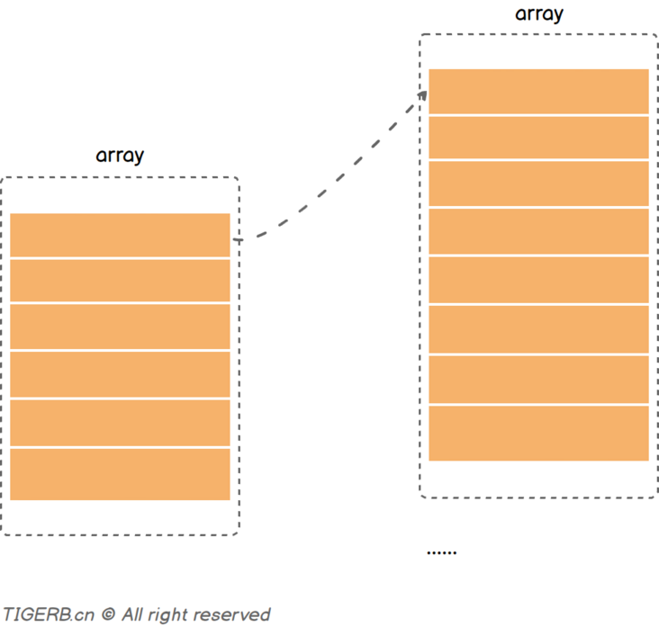

但是并不是只使用一个数组(连续内存空间)存放键和值，而是使用了两个数组分别存储键和值，图示如下：

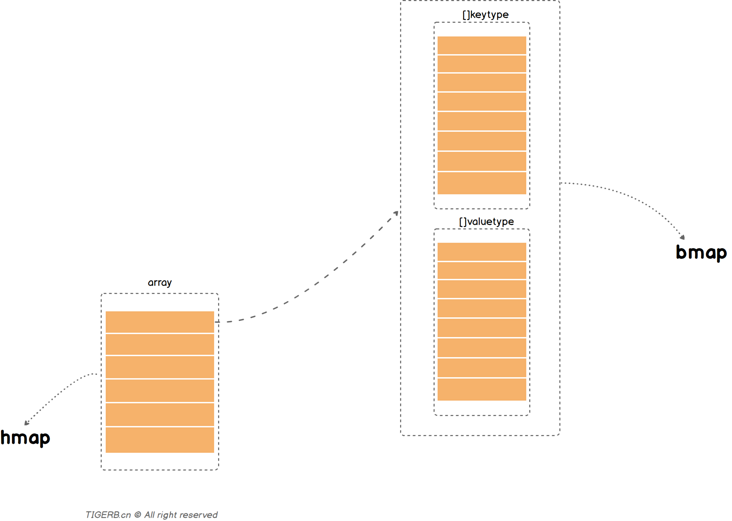

上图中：

- 分别对应的是两个核心的结构体`hmap`和`bmap`
- `bmap`里有两个数组分别存放key和value

把上面简化的关系转换一下，其实就是这样的一个大致关系，如下图所示：

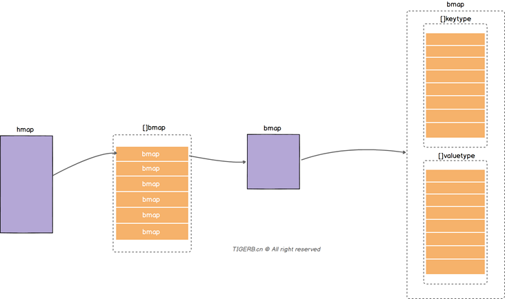

我们通过一次`读操作`为例，看看读取某个key的值的一个**大致过程**：

| 步骤编号 | 描述                                                         |
| -------- | ------------------------------------------------------------ |
| ①        | 通过hash函数获取目标key的**哈希**，哈希和数组的长度通过位操作获取数组位置的**索引**(备注：获取索引值的方式一般有取模或位操作，位操作的性能好些) |
| ②        | 遍历bmap里的键，和目标key对比获取**key的索引**(找不到则返回空值) |
| ③        | 根据**key的索引**通过计算偏移量，获取到对应value             |

读过程图示如下：

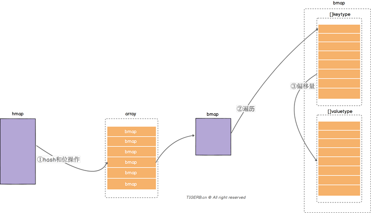

这么看起来是不是“很简单”、很清晰，所以读到这里，你是不是已经入门了`Go语言Map底层实现`并且：

- **大致**对Go语言Map底层实现有一个了解
- **大致知道**Go语言Map是如何读取数据的

想要深入学习，首先得了解下上面提到了实现Map的两个核心结构体`hmap`和`bmap`。

#### 核心结构体`hmap`

`hmap`的结构其实刚开始看起来其实还是比较复杂的，有不少的字段，具体字段如下图所示：

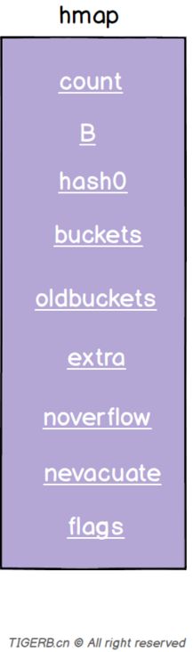

| 字段       | 解释                                                         |
| ---------- | ------------------------------------------------------------ |
| count      | 键值对的数量                                                 |
| B          | 2^B=len(buckets)                                             |
| hash0      | hash因子                                                     |
| buckets    | 指向一个数组(连续内存空间)，数组的类型为[]bmap，bmap类型就是存在键值对的结构下面会详细介绍，这个字段我们可以称之为正常桶。**如下图所示** |
| oldbuckets | 扩容时，存放之前的buckets(Map扩容相关字段)                   |
| extra      | 溢出桶结构，正常桶里面某个bmap存满了，会使用这里面的内存空间存放键值对 |
| noverflow  | 溢出桶里bmap大致的数量                                       |
| nevacuate  | 分流次数，成倍扩容分流操作计数的字段(Map扩容相关字段)        |
| flags      | 状态标识，比如正在被写、buckets和oldbuckets在被遍历、等量扩容(Map扩容相关字段) |

重点看一些字段的含义和用处。

#### 字段`buckets`

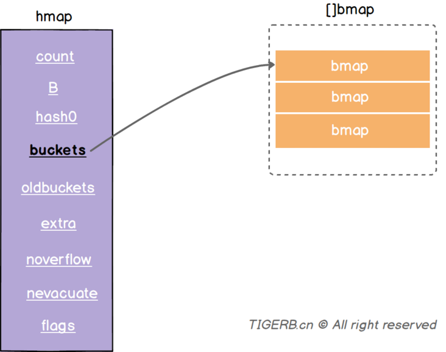

`buckets`指向了一个数组(连续的内存空间)，数组的元素是`bmap`类型，这个字段我们称之为正常桶。

`hmap`的源码和地址如下：

```go
// https://github.com/golang/go/blob/go1.13.8/src/runtime/map.go
type hmap struct {
    count     int 
    flags     uint8
    B         uint8 
    noverflow uint16 
    hash0     uint32
    buckets    unsafe.Pointer
    oldbuckets unsafe.Pointer
    nevacuate  uintptr 
    extra *mapextra
}
```

#### 核心结构体`bmap`

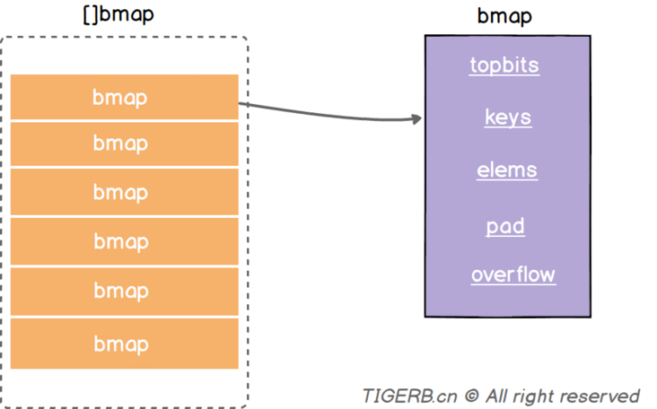

字段释义如下：

| 字段     | 解释                                                         |
| -------- | ------------------------------------------------------------ |
| topbits  | 长度为8的数组，[]uint8，元素为：key获取的hash的高8位，遍历时对比使用，提高性能。**如下图所示** |
| keys     | 长度为8的数组，[]keytype，元素为：具体的key值。**如下图所示** |
| elems    | 长度为8的数组，[]elemtype，元素为：键值对的key对应的值。**如下图所示** |
| overflow | 指向的`hmap.extra.overflow`溢出桶里的`bmap`，上面的字段`topbits`、`keys`、`elems`长度为8，最多存8组键值对，存满了就往指向的这个`bmap`里存 |
| pad      | 对齐内存使用的，不是每个bmap都有会这个字段，需要满足一定条件 |

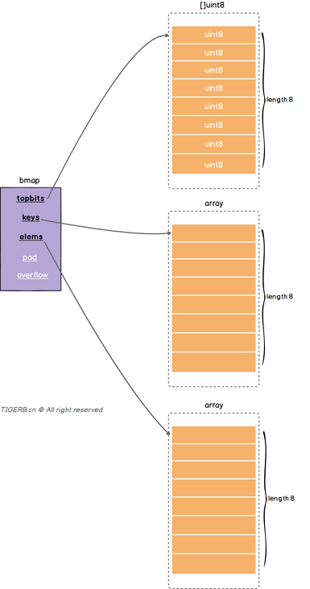

在bmap中定义的struct如下：

```go
// A bucket for a Go map.
type bmap struct {
	// tophash generally contains the top byte of the hash value
	// for each key in this bucket. If tophash[0] < minTopHash,
	// tophash[0] is a bucket evacuation state instead.
	tophash [bucketCnt]uint8
	// Followed by bucketCnt keys and then bucketCnt elems.
	// NOTE: packing all the keys together and then all the elems together makes the
	// code a bit more complicated than alternating key/elem/key/elem/... but it allows
	// us to eliminate padding which would be needed for, e.g., map[int64]int8.
	// Followed by an overflow pointer.
}
```

这里最初定义的结构体只有`tophash`一个字段，在编译期动态的为`bmap`添加剩余字段，这样就会得到一个新结构，推断出`bmap`结构字段的代码和位置如下：

```go
// https://github.com/golang/go/blob/go1.13.8/src/cmd/compile/internal/gc/reflect.go
func bmap(t *types.Type) *types.Type {
  // 略...

  field := make([]*types.Field, 0, 5)

    field = append(field, makefield("topbits", arr))

  // 略...
  
    keys := makefield("keys", arr)
    field = append(field, keys)

  // 略...
  
    elems := makefield("elems", arr)
    field = append(field, elems)

  // 略...
  
    if int(elemtype.Align) > Widthptr || int(keytype.Align) > Widthptr {
        field = append(field, makefield("pad", types.Types[TUINTPTR]))
    }

  // 略...
  
    overflow := makefield("overflow", otyp)
    field = append(field, overflow)

  // 略...
}
```

> 结论：每个`bmap`结构最多存放8组键值对。

#### `hmap`和`bmap`的基本结构合起来

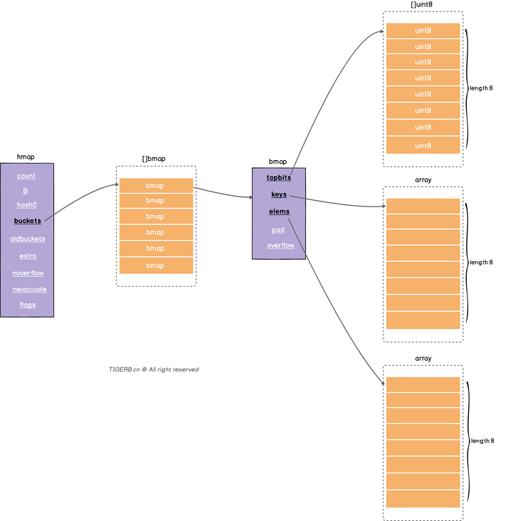

#### 溢出桶

上面讲`bmap`的时候，我们不是得到了个结论么“每个`bmap`结构最多存放8组键值对。”，所以问题来了

> 正常桶里的`bmap`存满了怎么办?

解决这个问题我们就要说到`hmap.extra`结构了，`hmap.extra`是个结构体，结构图示和字段释义如下：

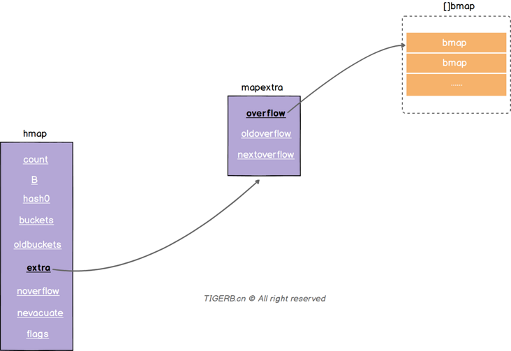

| 字段         | 解释                                                         |
| ------------ | ------------------------------------------------------------ |
| overflow     | 称之为**溢出桶**。和`hmap.buckets`的类型一样也是数组`[]bmap`，当正常桶`bmap`存满了的时候就使用`hmap.extra.overflow`的`bmap`。所以这里有个问题正常桶`hmap.buckets`里的`bmap`是怎么关联上溢出桶`hmap.extra.overflow`的`bmap`呢？我们下面说。 |
| oldoverflow  | 扩容时存放之前的overflow(Map扩容相关字段)                    |
| nextoverflow | 指向溢出桶里下一个可以使用的`bmap`                           |

源码和地址如下：

```go
// https://github.com/golang/go/blob/go1.13.8/src/runtime/map.go
type mapextra struct {
    overflow    *[]*bmap
    oldoverflow *[]*bmap
    nextOverflow *bmap
}
```

> 问题：正常桶`hmap.buckets`里的`bmap`是**怎么关联上**溢出桶`hmap.extra.overflow`的`bmap`呢？

答：就是我们介绍`bmap`结构时里的`bmap.overflow`字段(如下图所示)。`bmap.overflow`是个指针类型，存放了对应使用的溢出桶`hmap.extra.overflow`里的`bmap`的地址。

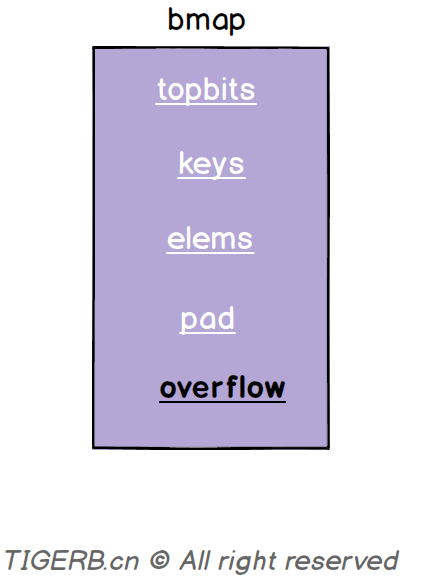

**问题又来了**：

> 问题：正常桶`hmap.buckets`里的`bmap`是**什么时候关联上**溢出桶`hmap.extra.overflow`的`bmap`呢？

答：Map写操作的时候。这里直接看关键代码：

```go
// https://github.com/golang/go/blob/go1.13.8/src/runtime/map.go
func mapassign(t *maptype, h *hmap, key unsafe.Pointer) unsafe.Pointer {
  // 略
again:
    // 略...
    var inserti *uint8
  // 略...
bucketloop:
    for {
        for i := uintptr(0); i < bucketCnt; i++ {
      // key的hash高8位不相等
            if b.tophash[i] != top {
        // 当前位置bmap.tophash的元素为空且还没有写入的记录(inserti已经写入的标记为)
                if isEmpty(b.tophash[i]) && inserti == nil {
          // inserti赋值为当前的hash高8位 标记写入成功
                    inserti = &b.tophash[i]
                    // 略...
                }
                // 略...
                continue
            }
            // 略...
            goto done
    }
    // 正常桶的bmap遍历完了 继续遍历溢出桶的bmap 如果有的话
        ovf := b.overflow(t)
        if ovf == nil {
            break
    }
        b = ovf
    }

  // 略...

  // 没写入成功(包含正常桶的bmap、溢出桶的bmap(如果有的话))
    if inserti == nil {
    // 分配新的bmap写
    newb := h.newoverflow(t, b)
    // 略...
    }

    // 略...
}

// 继续看h.newoverflow的代码
func (h *hmap) newoverflow(t *maptype, b *bmap) *bmap {
  var ovf *bmap
  // 如果hmap的存在溢出桶 且 溢出桶还没用完
    if h.extra != nil && h.extra.nextOverflow != nil {
    // 使用溢出桶的bmap
    ovf = h.extra.nextOverflow
    // 判断桶的bmap的overflow是不是空
    // 这里很巧妙。为啥？
    // 溢出桶初始化的时候会把最后一个bmap的overflow指向正常桶，值不为nil
    // 目的判断当前这个bmap是不是溢出桶里的最后一个
        if ovf.overflow(t) == nil {
      // 是nil
      // 说明不是最后一个
            h.extra.nextOverflow = (*bmap)(add(unsafe.Pointer(ovf), uintptr(t.bucketsize)))
        } else {
      // 不是nil
      // 则重置当前bmap的overflow为空
      ovf.setoverflow(t, nil)
      // 且 标记nextOverflow为nil 说明当前溢出桶用完了
            h.extra.nextOverflow = nil
        }
    } else {
    // 没有溢出桶 或者 溢出桶用完了
    // 内存空间重新分配一个bmap
        ovf = (*bmap)(newobject(t.bucket))
  }
  // 生成溢出桶bmap的计数器计数
    h.incrnoverflow()
  // 略...
  // 这行代码就是上面问题我们要的答案:
  // 正常桶`hmap.buckets`里的`bmap`在这里关联上溢出桶`hmap.extra.overflow`的`bmap`
    b.setoverflow(t, ovf)
    return ovf
}

// setoverflow函数的源码
func (b *bmap) setoverflow(t *maptype, ovf *bmap) {
  // 这行代码的意思：通过偏移量计算找到了bmap.overflow，并把ovf这个bmap的地址赋值给了bmap.overflow
    *(**bmap)(add(unsafe.Pointer(b), uintptr(t.bucketsize)-sys.PtrSize)) = ovf
}
```

下面代码这段代码解释了，上面的源码中为何如此判断预分配溢出桶的`bmap`是最后一个的原因。

```go
// https://github.com/golang/go/blob/go1.13.8/src/runtime/map.go
// 创建hmap的正常桶
func makeBucketArray(t *maptype, b uint8, dirtyalloc unsafe.Pointer) (buckets unsafe.Pointer, nextOverflow *bmap) {
  // 略...
    if base != nbuckets {
    // 略...
    last := (*bmap)(add(buckets, (nbuckets-1)*uintptr(t.bucketsize)))
    // 把溢出桶里 最后一个 `bmap`的`overflow`指先正常桶的第一个`bmap`
    // 获取预分配的溢出桶里`bmap`时，可以通过判断overflow是不是为nil判断是不是最后一个
        last.setoverflow(t, (*bmap)(buckets))
  }
  // 略...
}
```

**当`hmap`存在溢出桶时，且当前溢出桶只被使用了一个bmap**时，我们可以得到如下的关系图：

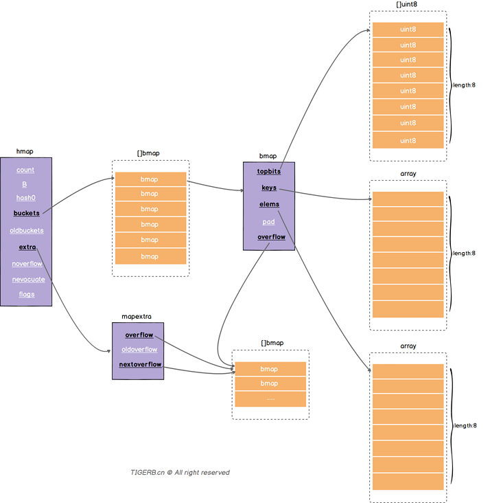

同时我们可以看出正常桶的`bmap`和溢出桶的`bmap`实际构成了链表关系，所以这也解释了开篇我们说到的“Go里面Map的实现**主要**用到了数组”，其次还用到了链表。

#### 再次分析map的读

通过上面的学习，我们再次通过一次读操作为例，看看读取某个key的值的一个大致过程：

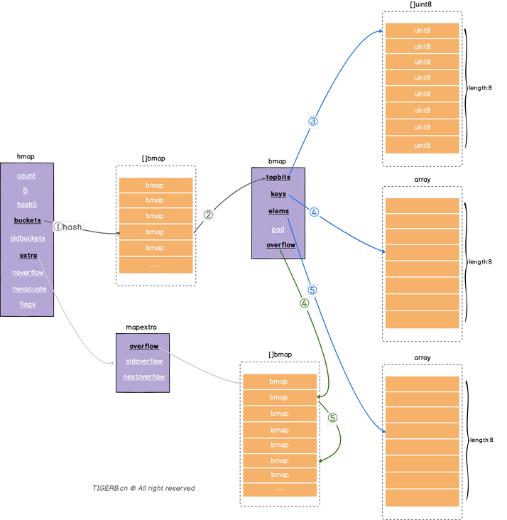

结合代码分析下整个大体的过程：

```go
func mapaccess1(t *maptype, h *hmap, key unsafe.Pointer) unsafe.Pointer {
    // ...略
    
    // ①通过hash函数获取当前key的哈希
    hash := alg.hash(key, uintptr(h.hash0))
    m := bucketMask(h.B)
    // ②通过当前key的哈希获取到对应的bmap结构的b
    // 这里的b 我们称之为“正常桶的bmap”
    // “正常桶的bmap”可能会对应到溢出桶的bmap结构，我们称之为“溢出桶的bmap”
    b := (*bmap)(add(h.buckets, (hash&m)*uintptr(t.bucketsize)))
    
    // ...略
    
    // 获取当前key的哈希的高8位
    top := tophash(hash)
bucketloop:
    // 下面的for循环是个简写，完整如下。
    // for b = b; b != nil; b = b.overflow(t) {
    // 可以知道b的初始值为上面的“正常桶的bmap”，则：
    // 第一次遍历：遍历的是“正常桶的bmap”
    // 如果正常桶没找到，则
    // 绿色线条④ 继续遍历：如果当前“正常桶的bmap”中的overflow值不为nil(说明“正常桶的bmap”关联了“溢出桶的bmap”)，则遍历当前指向的“溢出桶的bmap”继续 蓝色线条的③④⑤步骤
    for ; b != nil; b = b.overflow(t) {
        // 由于b的初始值为“正常桶的bmap”，第一次先遍历“正常桶的bmap”
        for i := uintptr(0); i < bucketCnt; i++ {
            // 蓝色线条③ 对比key哈希的高8位
            // 对比哈希的高8位目的是为了加速
            if b.tophash[i] != top {
                // emptyRest 标志位：表示当前位置已经是末尾了；删除操作会设置此标志位
                if b.tophash[i] == emptyRest {
                    break bucketloop
                }
                continue
            }
            // 找到了相同的hash高8位，则：找到对应索引位置i的key
            k := add(unsafe.Pointer(b), dataOffset+i*uintptr(t.keysize))
            if t.indirectkey() {
                k = *((*unsafe.Pointer)(k))
            }
            // 蓝色线条④ 对比key是不是一致
            if alg.equal(key, k) {
                // 蓝色线条⑤ key是一致，则：获取对应索引位置的值
                e := add(unsafe.Pointer(b), dataOffset+bucketCnt*uintptr(t.keysize)+i*uintptr(t.elemsize))
                if t.indirectelem() {
                    e = *((*unsafe.Pointer)(e))
                }
                // 返回找到的结果
                return e
            }
        }
    }
    // 正常桶、溢出桶都没找到则返回 “空值”
    return unsafe.Pointer(&zeroVal[0])
}
```

在查找过程中，主要是对key做定位，过程如下：

1. key 经过哈希计算后得到哈希值，共 64 个 bit 位（64位机，32位机就不讨论了，现在主流都是64位机），
2. 使用最后B个bit计算要落在那个桶里。如果B等于5，那么buckets数组的长度是2^5=32。假设有一个key经过hash计算之后是`1001011 0000111101100110010001111001010100010010110010101010 01010`.用最后的5个bit位，也就是01010，值为10，落在了10号桶。这个操作实际上就是取余操作，但是取余开销太大，所以代码实现上用的位操作代替。
3. 在用哈希值的高8位，找到此key在bucket中的位置，这是在寻找已有的 key。最开始桶内还没有 key，新加入的 key 会找到第一个空位放入。使用哈希值的高8位，在tophash中查找，如果命中通过偏移量找到key，判断key是否相同，如果key相同，通过偏移量找到value。在bmap中的tophash可以提高查询速度
4. 如果在bucket中没找到，并且overflow不为空，还要继续去overflow bucket中寻找，到找到或是所有的 key 槽位都找遍了，包括所有的 overflow bucket。