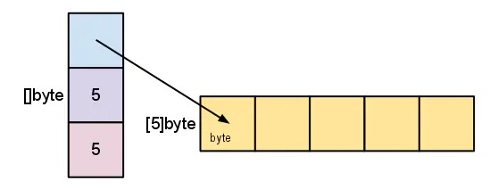

## 深入理解nil

### nil是什么

​		nil是一个预先声明的标识符，代表一个指针、channel、函数、接口、map或者slice的零值。

```go
// nil is a predeclared identifier representing the zero value for a
// pointer, channel, func, interface, map, or slice type.
var nil Type // Type must be a pointer, channel, func, interface, map, or slice type
```

​		因为nil是go语言中预先声明的，所以我们可以直接使用。因为是预声明的，并不是一个关键字之一，所以甚至可以修改，但是这样做是不推荐的。

```go
import (
	"errors"
	"fmt"
)

func main() {
	var nil = errors.New("hi")
	var a = nil	
	fmt.Println(a)
}
// output
// hi
```

### nil的默认类型

​		既然nil是一个预先声明的标识符，那么它的类型是什么呢？先来看一个例子

```go
import (
	"errors"
	"fmt"
)

func main() {
	var a = nil	
	fmt.Println(a)
}

//output
prog.go:9:6: use of untyped nil
```

从结果来看，nil是无类型的，即

> `nil`是没有默认类型的，它的类型具有不确定性，我们在使用它时必须要提供足够的信息能够让编译器推断`nil`期望的类型。

### nil的比较

​		nil的比较可以分为两种情况：

- nil标识符的比较
- nil的值比较

#### nil标识符的比较

​		先来看段代码

```go
import (
	"fmt"
)

func main() {
	fmt.Println(nil == nil)
}
// invalid operation: nil == nil (operator == not defined on untyped nil)
```

​		通过编译结果我们可以看出`==`符号对于`nil`来说是一种未定义的操作，所以是不可以比较两个`nil`的。

#### nil值的比较

​		因为`nil`是没有类型的，是在编译期根据上下文确定的，所以要比较`nil`的值也就是比较不同类型的`nil`，这又分为同一个类型的`nil`值比较和不同类型`nil`值的比较，分这两种情况我们分别来验证一下。

```go
func main()  {
 // 指针类型的nil比较
 fmt.Println((*int64)(nil) == (*int64)(nil))
 // channel 类型的nil比较
 fmt.Println((chan int)(nil) == (chan int)(nil))
 // func类型的nil比较
 fmt.Println((func())(nil) == (func())(nil)) // func() 只能与nil进行比较
 // interface类型的nil比较
 fmt.Println((interface{})(nil) == (interface{})(nil))
 // map类型的nil比较
 fmt.Println((map[string]int)(nil) == (map[string]int)(nil)) // map 只能与nil进行比较
 // slice类型的nil比较
 fmt.Println(([]int)(nil) == ([]int)(nil)) // slice 只能与nil进行比较
}

// output
./prog.go:13:28: invalid operation: (func())(nil) == (func())(nil) (func can only be compared to nil)
./prog.go:17:36: invalid operation: (map[string]int)(nil) == (map[string]int)(nil) (map can only be compared to nil)
./prog.go:19:27: invalid operation: ([]int)(nil) == ([]int)(nil) (slice can only be compared to nil)
```

​		从运行结果我们可以看出，指针类型`nil`、`channel`类型的`nil`、`interface`类型可以相互比较，而`func`类型、`map`类型、`slice`类型只能与`nil`标识符比较，两个类型相互比较是不合法的。

#### interface与nil比较需要注意的问题

```go
func main()  {
 err := Todo()
 fmt.Println(err == nil)
}

type Err interface {

}

type err struct {
 Code int64
 Msg string
}

func Todo() Err  {
 var res *err
 return res
}
// 运行结果
false
```

​		输出结果是`false`，在`Todo`方法内我们声明了一个变量`res`，这个变量是一个指针类型，零值是`nil`，返回的是接口类型，按理说返回值接口类型也应是`nil`才对，但是结果却不是这样。这是因为我们忽略了接口类型的一个概念，interface 不是单纯的值，而是分为类型和值。所以必须要类型和值同时都为 `nil` 的情况下，`interface` 的 `nil` 判断才会为 `true`。

​		这是一个新手很容易出现的问题，大家一定要注意这个问题。

### nil的作用

#### pointers

```go
var p *int
p == nil    // true
*p          // panic: invalid memory address or nil pointer dereference
```

​		指针表示指向内存的地址，如果对为nil的指针进行解引用的话就会导致panic。那么为`nil`的指针有什么用呢？先来看一个计算二叉树和的例子：

```go
type tree struct {
  v int
  l *tree
  r *tree
}

// first solution
func (t *tree) Sum() int {
  sum := t.v
  if t.l != nil {
    sum += t.l.Sum()
  }
  if t.r != nil {
    sum += t.r.Sum()
  }
  return sum
}
```

​		上面的代码有两个问题，一个是代码重复：

```go
if v != nil {
  v.m()
}
```

​		另一个是当`t`是`nil`的时候会panic：

```go
var t *tree
sum := t.Sum()   // panic: invalid memory address or nil pointer dereference
```

​		怎么解决上面的问题？我们先来看看一个指针接收器的例子：

```go
type person struct {}
func sayHi(p *person) { fmt.Println("hi") }
func (p *person) sayHi() { fmt.Println("hi") }
var p *person
p.sayHi() // hi
```

​		对于指针对象的方法来说，就算指针的值为`nil`也是可以调用的，基于此，我们可以对刚刚计算二叉树和的例子进行一下改造：

```go
func(t *tree) Sum() int {
  if t == nil {
    return 0
  }
  return t.v + t.l.Sum() + t.r.Sum()
}
```

​		跟刚才的代码一对比是不是简洁了很多？对于`nil`指针，只需要在方法前面判断一下就ok了，无需重复判断。换成打印二叉树的值或者查找二叉树的某个值都是一样的：

```go
func(t *tree) String() string {
  if t == nil {
    return ""
  }
  return fmt.Sprint(t.l, t.v, t.r)
}

// nil receivers are useful: Find
func (t *tree) Find(v int) bool {
  if t == nil {
    return false
  }
  return t.v == v || t.l.Find(v) || t.r.Find(v)
}
```

​		所以如果不是很需要的话，不要用NewX()去初始化值，而是使用它们的默认值。

#### slices

```go
// nil slices
var s []slice
len(s)  // 0
cap(s)  // 0
for range s  // iterates zero times
s[i]  // panic: index out of range
```

一个为`nil`的slice，除了不能索引外，其他的操作都是可以的，当你需要填充值的时候可以使用`append`函数，slice会自动进行扩充。那么为`nil`的slice的底层结构是怎样的呢？根据官方的文档，slice有三个元素，分别是长度、容量、指向数组的指针：


当有元素的时候：



所以我们并不需要担心slice的大小，使用append的话slice会自动扩容。（视频中说slice自动扩容速度很快，不必担心性能问题，这个值得商榷，在确定slice大小的情况只进行一次内存分配总是好的）


#### map

​		对于Go来说，map，function，channel都是特殊的指针，指向各自特定的实现，这个我们暂时可以不用管。

```go
// nil maps
var m map[t]u
len(m)  // 0
for range m // iterates zero times
v, ok := m[i] // zero(u), false
m[i] = x // panic: assignment to entry in nil map
```

​		对于`nil`的map，我们可以简单把它看成是一个只读的map，不能进行写操作，否则就会panic。那么`nil`的map有什么用呢？看一下这个例子：

```go
func NewGet(url string, headers map[string]string) (*http.Request, error) {
  req, err := http.NewRequest(http.MethodGet, url, nil)
  if err != nil {
    return nil, err
  }

  for k, v := range headers {
    req.Header.Set(k, v)
  }
  return req, nil
}
```

​		对于`NewGet`来说，我们需要传入一个类型为map的参数，并且这个函数只是对这个参数进行读取，我们可以传入一个非空的值：

```go
NewGet("http://google.com", map[string]string{
  "USER_AGENT": "golang/gopher",
},)
```

或者这样传：

```go
NewGet("http://google.com", map[string]string{})
```

​		但是前面也说了，map的零值是`nil`，所以当`header`为空的时候，我们也可以直接传入一个`nil`：

```go
NewGet("http://google.com", nil)
```

​		是不是简洁很多？所以，把`nil` map作为一个只读的空的map进行读取吧。

#### channel

```go
// nil channels
var c chan t
<- c      // blocks forever
c <- x    // blocks forever
close(c)  // panic: close of nil channel
```

​		关闭一个`nil`的channel会导致程序`panic`（如何关闭channel可以看这篇文章：[如何优雅地关闭Go channel](https://www.jianshu.com/p/d24dfbb33781)）举个例子，假如现在有两个channel负责输入，一个channel负责汇总，简单的实现代码：

```go
func merge(out chan<- int, a, b <-chan int) {
  for {
    select {
      case v := <-a:
        out <- v
      case v := <- b:
        out <- v
    }
  }
}
```

​		如果在外部调用中关闭了a或者b，那么就会不断地从a或者b中读出0，这和我们想要的不一样，我们想关闭a和b后就停止汇总了，修改一下代码：

```go
func merge(out chan<- int, a, b <-chan int) {
  for a != nil || b != nil {
    select {
      case v, ok := <-a:
          if !ok {
            a = nil
            fmt.Println("a is nil")
            continue
          }
          out <- v
      case v, ok := <-b:
          if !ok {
            b = nil
            fmt.Println("b is nil")
            continue
          }
          out <- v
    }
  }
  fmt.Println("close out")
  close(out)
}
```

​		在知道channel关闭后，将channel的值设为nil，这样子就相当于将这个select case子句停用了，因为`nil`的channel是永远阻塞的。

#### interface

​		interface并不是一个指针，它的底层实现由两部分组成，一个是类型，一个值，也就是类似于：(Type, Value)。只有当类型和值都是`nil`的时候，才等于`nil`。看看下面的代码：

```go
func do() error {   // error(*doError, nil)
  var err *doError
  return err  // nil of type *doError
}

func main() {
  err := do()
  fmt.Println(err == nil)
}
```

​		输出结果是`false`。`do`函数声明了一个`*doErro`的变量`err`，然后返回，返回值是`error`接口，但是这个时候的Type已经变成了：（*doError，nil），所以和`nil`肯定是不会相等的。所以我们在写函数的时候，不要声明具体的error变量，而是应该直接返回`nil`：

```go
func do() error {
  return nil
}
```

​		再来看看这个例子：

```go
func do() *doError {  // nil of type *doError
  return nil
}

func wrapDo() error { // error (*doError, nil)
  return do()       // nil of type *doError
}

func main() {
  err := wrapDo()   // error  (*doError, nil)
  fmt.Println(err == nil) // false
}
```

​		这里最终的输出结果也是`false`。为什么呢？尽管`wrapDo`函数返回的是`error`类型，但是`do`返回的却是`*doError`类型，也就是变成了（*doError，nil），自然也就和`nil`不相等了。因此，不要返回具体的错误类型。遵从这两条建议，才可以放心地使用`if x != nil`。

### 总结

​		nil是一个预声明，不是关键字，是可以被修改的，但最好不要这样做。nil的类型需要从使用时上下文中去推断。

​		两个nil直接比较时会报错，因为`==`对于nil是一个未定义操作。

​		对于pointer，nil可以用来判断该pointer是否为空，增加程序健壮性。

​		对于slice，可以初始化一个nil的slice，可以追加元素，但是不能直接访问为nil的slice

​		对于map，如果没有任何想要放入map的元素，就直接定义一个nil的map作为参数，这样在其他地方同样读不到任何值，与定义一个空map一样。

​		对于channel，在使用完channel后，可以设置为nil，这样子就相当于将这个select case子句停用了，因为`nil`的channel是永远阻塞的。

​		对于interface，只有在当类型和值都是`nil`的时候，才等于`nil`。